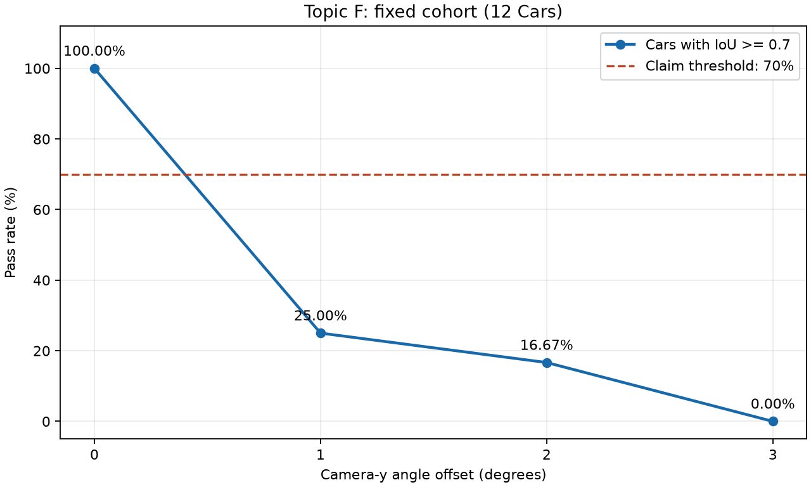

# Báo cáo Day 6: [ĐIỀN tên đề tài ngắn]

> Thay **mọi** ô có chữ ĐIỀN nằm trong ngoặc vuông bằng nội dung của bạn, xoá luôn cả dấu ngoặc vuông. Lệnh `python tools/check_submission.py` sẽ báo FAIL nếu còn sót bất kỳ chỗ nào.

- **Họ tên:** Bùi Việt Anh
- **MSSV:** 2A202602611
- **Lớp:** 3b-track4
- **Link repo:** https://github.com/VietAnh-AI2-UET/BuiVietAnh-2A202602611-Track4-Day21.git
- **Topic:** F
- **Dataset:** data/kitti_mini (thí nghiệm chính), data/synthetic (kiểm tra code)
- **Các frame đã dùng:** 000008, 000010, 000011, 000004, 000016, 000049

## 1. Claim

Một câu khẳng định kỹ thuật có thể kiểm chứng:

- ***Trên ít nhất 10 đối tượng Car không bị che khuất và nằm trọn trong ảnh của data/kitti_mini, ít nhất 70% hộp 2D tạo bằng cách chiếu 8 góc hộp 3D lên ảnh có IoU ≥ 0,7 so với hộp 2D trong nhãn gốc.***

## 2. Evidence

### Thiết kế thí nghiệm

- Mục tiêu: kiểm chứng claim ở cấu hình gốc và đánh giá ảnh hưởng
  của góc chiếu bị lệch đến độ khớp giữa hộp chiếu và hộp nhãn.
- Đối tượng: ít nhất 10 Car không bị che khuất, nằm trọn trong ảnh.
- Yếu tố thay đổi: góc lệch quanh trục đứng tại camera,
  gồm 0°, 1°, 2°, 3°.
- Giữ cố định: danh sách đối tượng, nhãn 2D gốc và cách tạo hộp 2D.
- Chỉ số: IoU trung bình và tỷ lệ đối tượng có IoU ≥ 0,7.
- Kiểm chứng claim: tại mức 0°, ít nhất 70% đối tượng đạt IoU ≥ 0,7.
- Kết quả đã lưu tại: results/topic_f_angle_sweep.csv.
- Trạng thái: đã chạy thí nghiệm chính và chạy lại đối chiếu, cùng 12 xe trên 6 frame.

### Kết quả thực đo

Danh sách frame cố định theo thứ tự xử lý: `000004`, `000008`, `000010`,
`000011`, `000016`, `000049`; số xe tương ứng: 2, 2, 3, 1, 2, 2.
Chọn tất cả Car có `occluded=0`, `truncated=0`, hộp nhãn nằm trọn trong ảnh
và dữ liệu hình học hợp lệ; không lọc theo khoảng cách hoặc IoU.
Danh sách 12 xe được chọn trước khi đo và giữ nguyên ở cả bốn góc.

| Góc lệch (độ) | Số xe | IoU trung bình | Tỷ lệ IoU ≥ 0,7 |
|---|---|---|---|
| 0 | 12 | 0,9707 | 100,00% |
| 1 | 12 | 0,6433 | 25,00% |
| 2 | 12 | 0,4164 | 16,67% |
| 3 | 12 | 0,2575 | 0,00% |

IoU trong bảng làm tròn đến 4 chữ số thập phân; tỷ lệ phần trăm làm tròn
đến 2 chữ số. CSV giữ số liệu với độ chính xác đầy đủ của số thực Python.
Kết luận dùng số gốc: tại 0°, 12/12 xe đạt IoU ≥ 0,7, tức tỷ lệ 1,0 ≥ 0,70.
**Kết quả ủng hộ claim trên mẫu 12 xe đã chọn.**

Ở mẫu này, cả IoU trung bình và tỷ lệ đạt đều giảm theo góc lệch.
Chỉ lệch 1° đã làm tỷ lệ đạt giảm từ 100% xuống 25% (3/12 xe);
tại 2° còn 2/12 xe và tại 3° không xe nào đạt. Đây là kết quả của mẫu
và cách giả lập này, chưa phải kết luận cho mọi xe hoặc mọi dữ liệu.

Phép giả lập quay 8 góc hộp 3D quanh trục y qua gốc camera, luôn từ tọa độ
gốc, giữ nguyên `P2` và ảnh. Góc dương đưa điểm phía trước camera sang phải.
Đây là sai lệch trong phép chiếu lên ảnh gốc, không phải ảnh chụp lại từ camera
đã chuyển động. Chiếu đủ 8 góc rồi mới cắt hộp theo biên ảnh; diện tích dùng
tọa độ liên tục, không cộng 1. Điều kiện chiếu là độ sâu > 0,1 m và mẫu số
phép chiếu > 1e-12. Xe không chiếu được hoặc có hộp hoàn toàn ngoài ảnh vẫn
được giữ trong mẫu, nhận IoU 0. Cả 48 dòng thực đo đều có trạng thái `ok`.
Chỉ góc thay đổi; không dùng ngẫu nhiên (`randomness=none`, `seed=null`),
không đo thời gian (`measure_latency=false`).

[Bảng tổng hợp](../results/topic_f_angle_sweep.csv) ·
[Kết quả từng xe](../results/topic_f_object_results.csv) ·
[Danh sách xe](../results/topic_f_selected_objects.csv) ·
[Cấu hình thí nghiệm](../results/topic_f_config.json)




Ảnh minh họa dùng xe đầu tiên trong danh sách cố định: frame `000004`,
`object_index=0` (chỉ số từ 0 sau khi bộ đọc bỏ `DontCare`). Hộp nhãn màu
xanh lá, hộp chiếu màu đỏ; cả bốn ô dùng cùng ảnh gốc và cùng xe.
Hai lần chạy cho 3 CSV và JSON có mã SHA256 tương ứng giống nhau;
bản đối chiếu nằm trong `results/repro_check/`.

## 3. Failure case

Nêu khi nào hệ thống hoặc phương pháp fail, vì sao fail, và liên hệ tới lớp nào trong 6 lớp debug: I/O, Geometry, Time, Preprocess, Model, Metric.


[ĐIỀN]

## 4. Khuyến nghị nếu triển khai thật

Use-case cụ thể (ADAS / robot / drone), trade-off và bước tiếp theo.

[ĐIỀN]

## 5. Cách chạy lại

Thư mục thực thi là gốc repo `BuiVietAnh-2A202602611-Track4-Day21`.
Đã dùng môi trường `.venv` có sẵn trên Windows: Python 3.11.9,
NumPy 2.4.6, OpenCV 5.0.0, Matplotlib 3.11.2. Các thư viện cần cho thí nghiệm
đều đã import thành công; không cài thêm dependency. `requirements.txt`
ghi các yêu cầu thư viện của repo; thí nghiệm này chạy CPU.

Các lệnh PowerShell sau đã được chạy thành công:

```powershell
.venv\Scripts\python.exe -m unittest discover -s src/tests -v
.venv\Scripts\python.exe -m src.topic_f_experiment --help
.venv\Scripts\python.exe -m src.topic_f_experiment --data-root data/kitti_mini --frames 000008 000010 000011 000004 000016 000049 --out-dir results
.venv\Scripts\python.exe -m src.topic_f_experiment --data-root data/kitti_mini --frames 000008 000010 000011 000004 000016 000049 --out-dir results/repro_check
```

Kiểm tra tự động: 17 test đạt, bao gồm hình học, chọn mẫu, đo bốn góc,
ghi file, tạo ảnh và lỗi khi chỉ có 9 xe. Lần chạy chính tạo 48 dòng chi tiết,
4 dòng tổng hợp, 3 CSV, 1 JSON và 2 PNG. Lần chạy đối chiếu tạo lại cùng bộ
file trong thư mục riêng. Đã dùng `Get-FileHash` kiểm tra như sau:

```powershell
foreach ($name in @('topic_f_selected_objects.csv', 'topic_f_object_results.csv', 'topic_f_angle_sweep.csv', 'topic_f_config.json')) {
    $firstHash = (Get-FileHash -LiteralPath (Join-Path results $name)).Hash
    $secondHash = (Get-FileHash -LiteralPath (Join-Path results/repro_check $name)).Hash
    if ($firstHash -ne $secondHash) { throw "Mismatch: $name" }
    Write-Output "$name : SHA256 match $firstHash"
}
```

Không yêu cầu PNG giống từng byte; đã mở cả hai ảnh chính để kiểm tra
chú thích và đối tượng. Các file kết quả có tên cố định sẽ được ghi đè khi
chạy lại thành công. Nếu chọn dưới 10 xe, chương trình báo số xe và dừng
trước khi ghi kết quả mới.

Lệnh demo CP2 đã ghi trước đó:

```powershell
python -m starter.projection --data-root data/kitti_mini --frame 000049
```

## 6. Khai báo sử dụng AI

Ghi rõ đã dùng công cụ AI nào, dùng vào việc gì, và bạn đã tự kiểm chứng kết quả đó bằng cách nào. Nếu không dùng AI, ghi "Không sử dụng". Xem quy định ở `RULES.md` mục 2.

| Công cụ | Dùng cho việc gì | Bạn đã kiểm chứng thế nào |
|---|---|---|
| chatgpt | Thiết kế lập trình hàm | Kiểm tra type đầu vào / ra |
| chatgpt | Đọc hiểu hàm | Hỏi chức năng của hàm, cách hàm xử lý luồng<br> Viết docstring cho hàm |
| chatgpt | Hỏi ý nghĩa của command | Chạy thử luôn |
| chatgpt | Tra cứu thông tin<br> | Tạm thời tin |
| codex | Xác định bước làm tiếp theo | Đọc lại CHECKPOINT.md |
| codex | Thiết kế thí nghiệm CP3 | Đọc lại xem có hợp lý không |
| codex | Lên implementation-plan cho các thí nghiệm trong CP3 | Đọc, duyệt implementation-plan | 