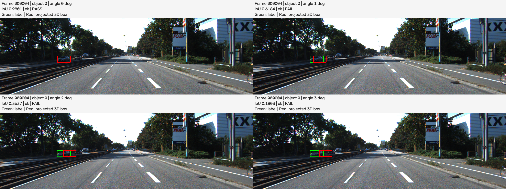

# Báo cáo Day 6: Auto-label support

> Thay **mọi** ô có chữ ĐIỀN nằm trong ngoặc vuông bằng nội dung của bạn, xoá luôn cả dấu ngoặc vuông. Lệnh `python tools/check_submission.py` sẽ báo FAIL nếu còn sót bất kỳ chỗ nào.

- **Họ tên:** Bùi Việt Anh
- **MSSV:** 2A202602611
- **Lớp:** 3b-track4
- **Link repo:** https://github.com/VietAnh-AI2-UET/BuiVietAnh-2A202602611-Track4-Day21.git
- **Topic:** F
- **Dataset:** data/kitti_mini (thí nghiệm chính), data/synthetic (kiểm tra code)
- **Các frame đã dùng:** 000008, 000010, 000011, 000004, 000016, 000049

## 1. Claim

Một câu khẳng định kỹ thuật có thể kiểm chứng:

- ***Trên ít nhất 10 đối tượng Car không bị che khuất và nằm trọn trong ảnh của data/kitti_mini, ít nhất 70% hộp 2D tạo bằng cách chiếu 8 góc hộp 3D lên ảnh có IoU ≥ 0,7 so với hộp 2D trong nhãn gốc.***

## 2. Evidence

### Thiết kế thí nghiệm

- Mục tiêu: kiểm chứng claim ở cấu hình gốc và đánh giá ảnh hưởng
  của góc chiếu bị lệch đến độ khớp giữa hộp chiếu và hộp nhãn.
- Đối tượng: ít nhất 10 Car không bị che khuất, nằm trọn trong ảnh.
- Yếu tố thay đổi: góc lệch quanh trục đứng tại camera,
  gồm 0°, 1°, 2°, 3°.
- Giữ cố định: danh sách đối tượng, nhãn 2D gốc và cách tạo hộp 2D.
- Chỉ số: IoU trung bình và tỷ lệ đối tượng có IoU ≥ 0,7.
- Kiểm chứng claim: tại mức 0°, ít nhất 70% đối tượng đạt IoU ≥ 0,7.
- Kết quả đã lưu tại: results/topic_f_angle_sweep.csv.
- Trạng thái: đã chạy thí nghiệm chính và chạy lại đối chiếu, cùng 12 xe trên 6 frame.

### Kết quả thực đo

Danh sách frame cố định theo thứ tự xử lý: `000004`, `000008`, `000010`,
`000011`, `000016`, `000049`; số xe tương ứng: 2, 2, 3, 1, 2, 2.
Chọn tất cả Car có `occluded=0`, `truncated=0`, hộp nhãn nằm trọn trong ảnh
và dữ liệu hình học hợp lệ; không lọc theo khoảng cách hoặc IoU.
Danh sách 12 xe được chọn trước khi đo và giữ nguyên ở cả bốn góc.

| Góc lệch (độ) | Số xe | IoU trung bình | Tỷ lệ IoU ≥ 0,7 |
|---|---|---|---|
| 0 | 12 | 0,9707 | 100,00% |
| 1 | 12 | 0,6433 | 25,00% |
| 2 | 12 | 0,4164 | 16,67% |
| 3 | 12 | 0,2575 | 0,00% |

IoU trong bảng làm tròn đến 4 chữ số thập phân; tỷ lệ phần trăm làm tròn
đến 2 chữ số. CSV giữ số liệu với độ chính xác đầy đủ của số thực Python.
Kết luận dùng số gốc: tại 0°, 12/12 xe đạt IoU ≥ 0,7, tức tỷ lệ 1,0 ≥ 0,70.
**Kết quả ủng hộ claim trên mẫu 12 xe đã chọn.**

Ở mẫu này, cả IoU trung bình và tỷ lệ đạt đều giảm theo góc lệch.
Chỉ lệch 1° đã làm tỷ lệ đạt giảm từ 100% xuống 25% (3/12 xe);
tại 2° còn 2/12 xe và tại 3° không xe nào đạt. Đây là kết quả của mẫu
và cách giả lập này, chưa phải kết luận cho mọi xe hoặc mọi dữ liệu.

Giả lập xoay 8 góc hộp 3D quanh trục đứng của camera từ tọa độ gốc,
giữ nguyên ảnh và ma trận chiếu `P2`. Chỉ góc chiếu thay đổi, không mô phỏng
ảnh chụp mới, không dùng ngẫu nhiên và không đo thời gian.
Hộp được cắt theo biên ảnh sau khi chiếu; xe không chiếu được hoặc nằm hoàn
toàn ngoài ảnh nhận IoU 0. Cả 48 kết quả đều có trạng thái `ok`.

[Bảng tổng hợp](../results/topic_f_angle_sweep.csv) ·
[Kết quả từng xe](../results/topic_f_object_results.csv) ·
[Danh sách xe](../results/topic_f_selected_objects.csv) ·
[Cấu hình thí nghiệm](../results/topic_f_config.json)


Ảnh minh họa dùng xe đầu tiên trong danh sách cố định: frame `000004`,
`object_index=0` (chỉ số từ 0 sau khi bộ đọc bỏ `DontCare`). Hộp nhãn màu
xanh lá, hộp chiếu màu đỏ; cả bốn ô dùng cùng ảnh gốc và cùng xe.
Hai lần chạy cho 3 CSV và JSON có mã SHA256 tương ứng giống nhau;
bản đối chiếu nằm trong `results/repro_check/`.

## 3. Failure case

Nêu khi nào hệ thống hoặc phương pháp fail, vì sao fail, và liên hệ tới lớp nào trong 6 lớp debug: I/O, Geometry, Time, Preprocess, Model, Metric.



**Trường hợp này thuộc lỗi Geometry**

Phân tích:
- Thí nghiệm trong CP3 tiến hành bằng cách giả lập camera bị lệch
- Khi camera không bị lệch, tức 0 độ, IOU là 0.9801, và giảm dần khi tăng độ lệch lên 1, 2, 3
- Hiện tượng này xảy ra do phép chiếu 3D từ lidar sang 2D của camera bị mất đồng bộ, dẫn đến sai số tính toán, nên khoanh vùng sai
- Trên thực tế, lidar và camera sẽ dễ bị mất đồng bộ trong các điều kiện như: Giá đỡ cảm biến bị lỏng, xe va chạm làm cảm biến xoay lệch, hoặc cảm biến được tháo lắp lại nhưng chưa đo và cập nhật lại vị trí, hướng lắp.

## 4. Khuyến nghị nếu triển khai thật

- **Ứng dụng:** Hỗ trợ gán nhãn xe trong ảnh để tạo dữ liệu cho hệ thống hỗ trợ lái xe (ADAS); người gán nhãn kiểm tra và sửa hộp được chiếu từ dữ liệu 3D.
- **Đánh đổi:** Giảm thao tác vẽ hộp thủ công nhưng cần đo chính xác vị trí và hướng tương đối giữa LiDAR và camera. Trong mẫu thử, lệch 1° đã làm tỷ lệ hộp đạt yêu cầu giảm từ 100% xuống 25%.
- **Bước tiếp theo:** Kiểm tra lại vị trí, hướng lắp cảm biến; thử trên nhiều xe, khoảng cách và mức che khuất hơn; đo thời gian gán nhãn và sửa hộp để đánh giá lợi ích thực tế.

## 5. Cách chạy lại

Các lệnh dưới đây dùng PowerShell trên Windows. Cần cài Python 3.10 trở lên;
thí nghiệm chạy bằng CPU, không cần GPU. Dữ liệu `data/kitti_mini` có sẵn trong repo.

### Bước 1: Chuẩn bị môi trường

Sau khi tải repo, mở PowerShell tại thư mục chứa repo và chạy:

```powershell
cd BuiVietAnh-2A202602611-Track4-Day21
python -m venv .venv
.venv\Scripts\python.exe -m pip install -r requirements.txt
```

Nếu đã đứng tại thư mục gốc của repo thì bỏ qua lệnh `cd`.
Các bước tiếp theo gọi trực tiếp Python trong `.venv`, không cần kích hoạt môi trường.

### Bước 2: Kiểm tra trước khi chạy

```powershell
.venv\Scripts\python.exe -m unittest discover -s src/tests -v
.venv\Scripts\python.exe -m src.topic_f_experiment --help
```

Lệnh đầu chạy các bài kiểm tra; hãy kiểm tra dòng tổng kết có `OK`.
Lệnh sau hiển thị các tùy chọn của chương trình thí nghiệm.

### Bước 3: Chạy thí nghiệm chính

```powershell
.venv\Scripts\python.exe -m src.topic_f_experiment --data-root data/kitti_mini --frames 000008 000010 000011 000004 000016 000049 --out-dir results
```

Sau khi lệnh hoàn tất, xem kết quả trong `results/`:

- `topic_f_selected_objects.csv`: danh sách xe được chọn.
- `topic_f_object_results.csv`: kết quả từng xe ở từng góc lệch.
- `topic_f_angle_sweep.csv`: bảng tổng hợp theo góc lệch.
- `topic_f_config.json`: cấu hình thí nghiệm.
- `figures/topic_f_angle_sweep.png` và `figures/topic_f_example_comparison.png`: biểu đồ và ảnh so sánh.

Các file cùng tên trong thư mục đầu ra sẽ được ghi đè khi chạy lại thành công.
Nếu chọn dưới 10 xe đủ điều kiện, chương trình báo số xe và dừng trước khi ghi kết quả mới.

### Bước 4: Kiểm tra khả năng chạy lại (tùy chọn)

Chạy cùng cấu hình, lưu vào thư mục riêng:

```powershell
.venv\Scripts\python.exe -m src.topic_f_experiment --data-root data/kitti_mini --frames 000008 000010 000011 000004 000016 000049 --out-dir results/repro_check
```

So sánh nội dung các file CSV và JSON bằng mã SHA256 (mã dùng để kiểm tra file có giống nhau):

```powershell
foreach ($name in @('topic_f_selected_objects.csv', 'topic_f_object_results.csv', 'topic_f_angle_sweep.csv', 'topic_f_config.json')) {
    $firstHash = (Get-FileHash -LiteralPath (Join-Path results $name)).Hash
    $secondHash = (Get-FileHash -LiteralPath (Join-Path results/repro_check $name)).Hash
    if ($firstHash -ne $secondHash) { throw "Mismatch: $name" }
    Write-Output "$name : SHA256 match $firstHash"
}
```

Nếu các file giống nhau, lệnh in `SHA256 match` cho từng file; nếu khác nhau,
lệnh báo `Mismatch`. Mở hai ảnh trong `results/figures/` để kiểm tra chú thích
và các hộp trên ảnh; không yêu cầu file PNG giống từng byte giữa hai lần chạy.

### Chạy demo phép chiếu CP2 (tùy chọn)

```powershell
.venv\Scripts\python.exe -m starter.projection --data-root data/kitti_mini --frame 000049
```

## 6. Khai báo sử dụng AI

Ghi rõ đã dùng công cụ AI nào, dùng vào việc gì, và bạn đã tự kiểm chứng kết quả đó bằng cách nào. Nếu không dùng AI, ghi "Không sử dụng". Xem quy định ở `RULES.md` mục 2.

| Công cụ | Dùng cho việc gì | Bạn đã kiểm chứng thế nào |
|---|---|---|
| chatgpt | Thiết kế lập trình hàm | Kiểm tra type đầu vào / ra |
| chatgpt | Đọc hiểu hàm | Hỏi chức năng của hàm, cách hàm xử lý luồng<br> Viết docstring cho hàm |
| chatgpt | Hỏi ý nghĩa của command | Chạy thử luôn |
| chatgpt | Tra cứu thông tin<br> | Tạm thời tin |
| codex | Xác định bước làm tiếp theo | Đọc lại CHECKPOINT.md |
| codex | Thiết kế thí nghiệm CP3 | Đọc lại xem có hợp lý không |
| codex | Lên implementation-plan cho các thí nghiệm trong CP3 | Đọc, duyệt implementation-plan | 
